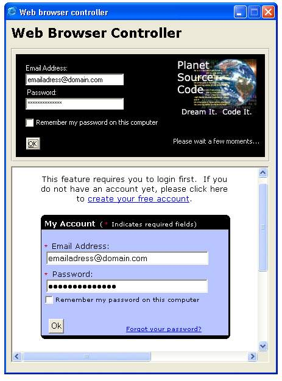



## WBC \- Web Browser Controller \-

### Description

This small source will teach how you can control the items in webpage opened in &#8220;web browser control&#8221; from your vb project and directly send the written texts, values commands to the given page. In this case I try Pscode login page with vb section you can try any page. Please note this is just the basic method, feel free to advance and handle the code as much as you want. Do I have to remind to not be a lamer and use this as Trojan coding etc?. So if you like this code please votes most welcomed and appreciated thank you.
 
### More Info
 

             |
---                |---
**Submitted On**   |2006-03-07 19:50:02
**By**             |[kegham](https://github.com/Planet-Source-Code/PSCIndex/blob/master/ByAuthor/kegham.md)
**Level**          |Intermediate
**User Rating**    |5.0 (15 globes from 3 users)
**Compatibility**  |VB 5\.0, VB 6\.0
**Category**       |[Internet/ HTML](https://github.com/Planet-Source-Code/PSCIndex/blob/master/ByCategory/internet-html__1-34.md)
**World**          |[Visual Basic](https://github.com/Planet-Source-Code/PSCIndex/blob/master/ByWorld/visual-basic.md)
**Archive File**   |[WBC\_\-\_Web\_197865372006\.zip](https://github.com/Planet-Source-Code/kegham-wbc-web-browser-controller__1-64573/archive/master.zip)

